# Tài liệu thiết kế
Tài liệu phân tích thiết kế hệ thống trước khi xây dựng phần mềm

## Sơ đồ thực thể - quan hệ (ERD)
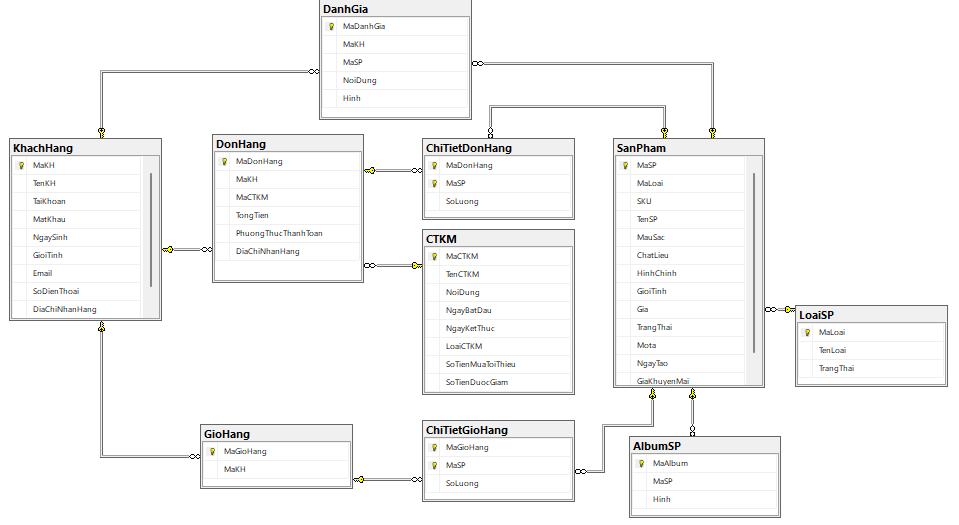
## Thiết kế và mô tả mô hình dữ liệu vật lý
### 1) CSDL
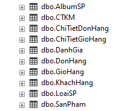
#### Mô tả:
- CSDL: Cơ sở dữ liệu

### 2) Bảng Loại sản phẩm
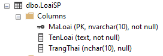
#### Mô tả:
- MaLoai: Mã loại sản phẩm
- TenLoai: Tên loại sản phẩm
- TrangThai: Trạng thái hiển thị của loại sản phẩm
### 3) Bảng Sản phẩm
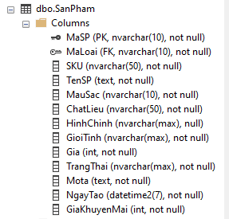
#### Mô tả:
- MaSP: Mã sản phẩm
- MaLoai: Mã loại sản phẩm
- TenSP: Tên sản phẩm
- MauSac: Màu sắc của sản phẩm
- ChatLieu: Chất liệu của sản phẩm
- HinhChinh: Hình hiển thị chính của sản phẩm
- GioiTinh: Sản phẩm dành cho giới tính nào
- Gia: Giá sản phẩm
- TrangThai: Trạng thái hiển thị của sản phẩm
- MoTa: Mô tả
- NgayTao: Ngày tạo sản phẩm
- GiaKhuyenMai: Giá khuyến mãi của sản phẩm

### 4) Bảng Album Sản phẩm
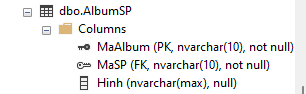
#### Mô tả:
- MaAlbum: Mã Album ảnh của sản phẩm
- MaSP: Mã sản phẩm
- Hinh: Hình mô tả sản phẩm

### 5) Bảng Khách hàng
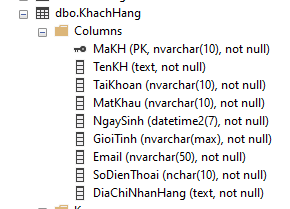
#### Mô tả:
- MaKH: Mã khách hàng
- TenKH: Tên khách hàng
- TaiKhoan: Tài khoản
- MatKhau: Mật khẩu
- NgaySinh: Ngày sinh
- GioiTinh: Giới tính 
- Email: Email
- SoDienThoai: Số điện thoại
- DiaChiNhanHang: Địa chỉ nhận hàng

### 6) Bảng Đánh giá
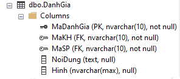
#### Mô tả:
- MaDanhGia: Mã đánh giá
- MaKH: Mã khách hàng
- MaSP: Mã sản phẩm
- NoiDung: Nội dung đánh giá
- Hinh: Hình đính kèm đánh giá

### 7) Bảng Chương trình khuyến mãi
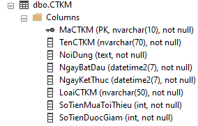
#### Mô tả:
- MaCTKM: Mã CTKM
- TenCTKM: Tên CTKM
- NoiDung: Nội dung
- NgayBatDau: Ngày bắt đầu
- NgayKetThuc: Ngày kết thúc
- LoaiCTKM: Loại CTKM
- SoTienMuaToiThieu: Số tiền mua tối thiểu
- SoTienDuocGiam: Số tiền được giảm

### 8) Bảng Giỏ hàng
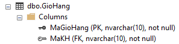
#### Mô tả:
- MaGioHang: Mã giỏ hàng
- MaKH: Mã khách hàng

### 9) Bảng Chi tiết giỏ hàng
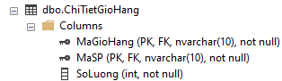
#### Mô tả:
- MaGioHang: Mã giỏ hàng
- MaSP: Mã sản phẩm
- SoLuong: Số lượng sản phẩm

### 10) Bảng Đơn hàng
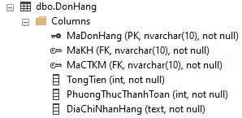
#### Mô tả:
- MaDonHang: Mã đơn hàng
- MaKH: Mã khách hàng
- MaCTKM: Mã CTKM
- TongTien: Tổng tiền
- PhuongThucThanhToan: Phương thức thanh toán
- DiaChiNhanHang: Địa chỉ nhận hàng

### 11) Bảng Chi tiết đơn hàng
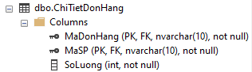
#### Mô tả:
- MaDonHang: Mã đơn hàng
- MaSP: Mã sản phẩm
- SoLuong: Số lượng sản phẩm